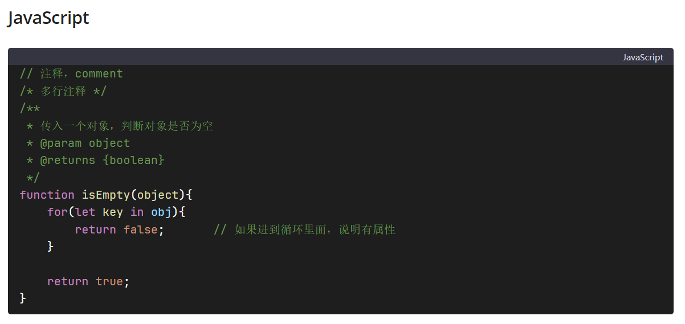

## 简介

这是一个 Obsidian 的自定义主题，该主题是个大杂烩，借鉴了 ：

- Typora 自带的 GitHub 主题
- [l3ony2k](https://github.com/l3ony2k)/**[Typora-D42ker-Github-theme](https://github.com/l3ony2k/Typora-D42ker-Github-theme)**
- JetBrains 主题：[Visual Studio Code Dark Plus Theme](https://plugins.jetbrains.com/plugin/12255-visual-studio-code-dark-plus-theme) 
- [ChatGPT UI](https://chat.openai.com)

实时预览模式用得多，其他模式适配一般

## 效果图

仅展示实时预览模式

日间模式





夜间模式


## 使用方法

在你的 Obsidian 仓库根目录的 `.obsidian\themes\` 目录下新建一个目录 `my-theme` ，再在 `my-theme` 目录下，新建一个 `manifest.json` 文件，填入以下内容：

```json
{
	"name": "my-theme",
	"version": "1.0.0",
	"minAppVersion": "1.0.0",
	"author": "lb-fes",
	"authorUrl": "https://github.com/lb-fes"
}
```

本项目采用 SCSS 来预处理 CSS 。要想使用本主题需要将 SCSS 代码编译成 CSS 代码。

首先需要安装 [dart-sass](https://github.com/sass/dart-sass) 

克隆本项目到本地。

用 WebStorm 或 VSCode 打开本项目

在根目录下的终端中，运行以下命令中的一个即可， `E:\backup\文档\` 可自行修改为你的 obsidian 仓库路径 

编译

```bash
sass theme.scss E:\backup\文档\.obsidian\themes\my-theme\theme.css --no-source-map
```

编译并监视

```bash
sass --watch theme.scss E:\backup\文档\.obsidian\themes\my-theme\theme.css --no-source-map
```

编译并压缩代码(勿用，obsidian 对压缩代码的兼容性不好？)：

```bash
sass theme.scss E:\backup\文档\.obsidian\themes\my-theme\theme.css --style=compressed --no-source-map
```

本项目提供了一个 [测试文件](测试文件.md) ，在 Obsidian 中应用了 `my-theme` 主题后，可查看相应的样式。

本项目有完备的注释，可自行修改成适合自己的主题。

注意事项：

主题文件名必须和manifest.json中的 name 一样，否则 obsidian 不能正确加载该主题。

修改 manifest.json 代码后必须重启 obsidian 才能应用新的主题。

## License

MIT


